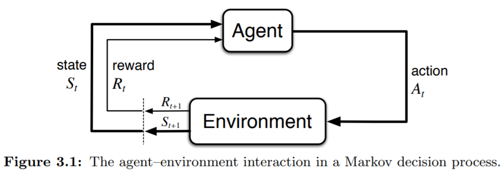

**Fundamentals of Reinforcement Learning Week2 Notes**

MDPs are a classical formalization of sequential decision making, where actions influence not just immediate rewards, but also subsequent situations, or states, and through those future rewards. Thus MDPs involve delayed reward and the need to tradeoff immediate and delayed reward. Whereas in bandit problems we estimated the value $q\_\*(a)$ of each action $a$, in MDPs we estimate the value $q\_\*(s, a)$ of each action $a$ in each state $s$, or we estimate the value $v\_\*(s)$ of each state given optimal action selections.

# The Agent-Environment Interface

## General Definition

The learner and decision maker is called the agent. The thing it interacts with, comprising everything outside the agent, is called the environment. At time $t$, the agent receive some representation of the environment $state$, $S\_t \in S$, and on the basis select an $action$, $A\_t \in A(s)$. One time step later, the agent receive a $reward$, $R\_{t+1} \in R$, from the environment and find itself in a new $state$, $S\_{t+1} \in S$. With time goes one, the sequence would be

$$ S\_0, A\_0, R\_1, S\_1, A\_1, R\_2, S\_2, A\_2, \dots $$

In $finite$ MDP, the $S$, $R$, $A$ all has finite number of elements. The whole process can also be defined as

$$ p(s',r|s,a) \doteq Pr\\\{S\_t=s',R\_t=r|S\_{t-1}=s,A\_{t-1}=a\\\} \tag{1}$$

where $s', s \in S$, $r \in R$, $a \in A$. The function $p$ defines the dynamics of the MDP. The dynamics function $p$ : $S \times R \times S \times A \rightarrow [0, 1]$ is an ordinary deterministic function of four arguments. And it follows the rules below:

$$ \sum\_{s' \in S}\sum\_{r \in R}p(s',r|s,a)=1, \text{for all} s \in S, a \in A(s) \tag{2}$$

In MDP, for current $state$ and $reward$, they only depend on the previous $state$ and $action$.  This is best viewed as a restriction not on the decision process, but on the $state$. The state must include information about all aspects of the past agent–environment interaction that make a difference for the future. If it does, then the state is said to have the Markov property.

## Common Used Formulas

The formula (2) is the most common used. There are also three important formulas used in solving MDP problems for convenience. The first one is the *state transaction probabilities* as a three augments function $p$: $S \times S \times A \rightarrow [0,1]$,

$$ p(s'|s,a) \doteq Pr\\\{S\_t=s'|S\_{t-1}=s, A\_{t-1}=a\\\} = \sum\_{r \in R}p(s', r|s, a) \tag{3}$$

The second one is the expect rewards for state-action pairs as a two augments function $p$: $S \times A \rightarrow \mathbb{R}$,

$$ r(s,a) \doteq \mathbb{E}[R\_t|S\_{t-1}=s, A\_{t-1}=a] = \sum\_{r \in R}r\sum\_{s' \in S}p(s',r|s,a) \tag{4}$$

The third one is the expect rewards for state-action-next-state triples as a three augments function $p$: $S \times A \times S \rightarrow \mathbb{R}$,

$$ r(s',a,s) \doteq \mathbb{E}[R\_t|S\_{t-1}=s,A\_{t-1}=a,S\_t=s'] = \sum\_{r \in R}r\frac{p(s',r|s,a)}{p(s'|s,a)} \tag{5}$$

## Boundaries of Agent and Environment

The MDP framework is abstract and flexible and can be applied to many different problems in several ways, containing both high-level and low level controls, states, etc. The boundary of agent and environment is different from the physical reality. The boundary represents the limit of the agent's ***absolute control***, not of its knowledge. The general rule we follow is that anything that cannot be changed arbitrarily by the agent is considered to be outside of it and thus part of its environment.

The MDP framework is a considerable abstraction of the problem of goal-directed learning from interaction. For any goal-directed problem, it can be reduced to the three signals: $action$, $state$, and $rewards$.

# Goals and Rewards

At each time step $t$, the reward is a simple number, $R\_t \in \mathbb{R}$. Informally, the agent’s goal is to maximize the total amount of reward it receives, in other word, the cumulative reward in the long run, rather than maximizing immediate reward. The use of a reward signal to formalize the idea of a goal is one of the most distinctive features of reinforcement learning. Although formulating goals in terms of reward signals might at first appear limiting, in practice it has proved to be flexible and widely applicable.

- The reward signal is your way of communicating to the robot ***what*** you want it to achieve, ***not how*** you want it achieved.

# Returns and Episodes

## Episodic Tasks

Features of this kind of tasks.

- interaction breaks naturally into ***episodes***
- Each episode ends in a ***terminal state***
- Episodes are ***independent***.

In some tasks, natural agent-environment interactions sequence can be broken into several sub-sequences, which is also called ***episode***. For example, when you play a game, your interaction with game is natural and non-interrupted. But when you win or lose a game, you reach a final state of a game and the actions before the end is a sub-sequence. To formulize the long run cumulative rewards, from next time $t+1$ to the final state $T$, we can simply sum them up or set weights for future rewards. The formula is as follows,

$$ G\_t \doteq R\_{t+1} + R\_{t+2} + \cdots + R\_T \tag{6}$$

where $T$ is the final time step.

## Continuing Tasks

In contrast to episodic tasks, this kind of task goes on continually and ***no terminal state***. To formulize it, One common way is to use ***discounting***. The total long run reward, called *discounted return*,

$$ G\_t \doteq R\_{t+1}+\gamma R\_{t+2}+\gamma^2R\_{t+3}+\cdots = \sum\_{k=0}^\infty{\gamma^kR\_{t+k+1}} \tag{7}$$

where $\gamma$ is the *discount rate*, $0 \leq \gamma \leq 1$.

- $\gamma=0$, the agent is "myopic" and only concerns to maximize immediate rewards, which may reduce the final return.
- $0 < \gamma < 1$, we will get a result as long as the reward sequence $R\_k$ is finite.
- $\gamma=1$, the agent becomes more farsighted.

If the reward $R\_k$ is nonzero and constant and $\gamma < 1$, the total reward $G\_t$ is,

$$ G\_t = R\sum\_{k=0}^\infty \gamma^k = R\frac{1}{1-\gamma} \tag{8}$$

If we can assume $R\_{max}$ for $R\_k$, and $\gamma < 1$, the total reward $G\_t$ would be,

$$ G\_t = \sum\_{k=0}^\infty{\gamma^kR\_{t+k+1}} \leq R\_{max}\sum\_{k=0}^\infty \gamma^k = R\_{max}\frac{1}{1-\gamma} \tag{9}$$

Where $G\_t$ is finite.

We can also write the formula above into another form,

$$
\begin{align}
G\_t &\doteq R\_{t+1}+\gamma R\_{t+2}+\gamma^2R\_{t+3}+\cdots \\\\
&= R\_{t+1} + \gamma(R\_{t+2} + \gamma R\_{t+3} + \cdots) \\\\
&= R\_{t+1} + \gamma G\_{t+1}
\end{align}
\tag{10}
$$

where $t < T$.
