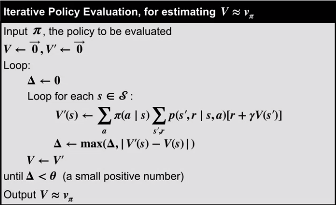
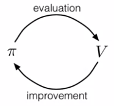
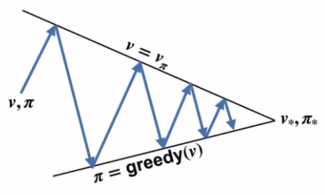
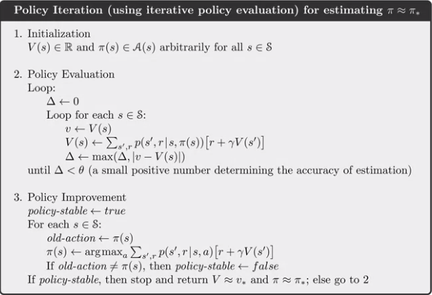
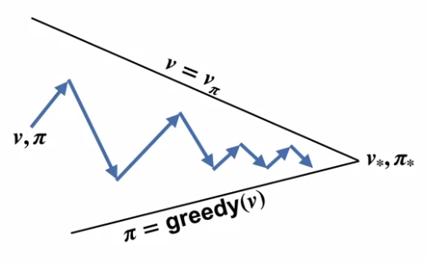
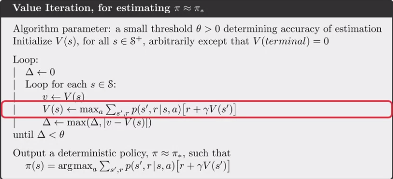

# Policy Evaluation and Control

- ***Policy evaluation*** is a task of determining the state-value function $V\_\pi$, for a particular policy $\pi$. It is also called *prediction problem*.
- ***Control*** is the task of improving an existing policy. it is also called *policy improvement*.
- ***Dynamic programming*** can be used to solve both problems, if we can get the dynamic function $p(s',r|s,a)$, which appears in all bellman functions about $v$ and $q$.

## Policy Evaluation

Recall the formula of $V\_\pi(s)$,

$$
\begin{align}
v\_\pi(s) &\doteq \mathbb{E}\_\pi[G\_t|S\_t=s] \\\\
&= \mathbb{E}\_\pi[R\_{t+1}+\gamma G\_{t+1}|S\_t=s] \\\\
&= \mathbb{E}\_\pi[R\_{t+1}+\gamma v\_\pi(S\_{t+1})|S\_t=s] \\\\
&= \sum\_a\pi(a|s)\sum\_{s',r}p(s',r|s,a)[r+\gamma v\_\pi(s')]
\end{align}
$$

According to the above formula, it is a system of $|S|$ simultaneous linear equations in $|S|$ unknowns. However, in practice, due to the limitation about computation resource and time consuming, ***Dynamic Programming*** is always used to solve above problems. And ***iteration method*** is the most common used and suitable. To convert the above formula into iteration format, we just need to convert the note $\pi$ to iteration step indicator $k$. Then we get the new formula,

$$
v\_{k+1}(s) \leftarrow \sum\_a\pi(a|s)\sum\_{s',r}p(s',r|s,a)[r+\gamma v\_k(s')]
$$

It is proved that the state-value function will be optimized.

Moreover, there are two methods about implementing the iterate formula. One is to use two array to represent the state before and after one iteration. Another is to only use the original state array and update in-place. In practice, the second one provides us a ***faster converge speed***, since it gets to use the updated values sooner, and occupies ***less memory space*** than the two array version implementation.

Then the algorithm pseudo-code is:

In practice, we almost cannot reach the convergence in short time, so that we set a margin $\theta$ to help us stop early and keep a relative good result.

## Policy Control

Recall that,

$$
\begin{align}
\pi'(s) &\doteq \arg\max\_aq\_\pi(s, a) \\\\
&= \arg\max\_a\mathbb{E}[R\_{t+1}+\gamma v\_\pi(S\_{t+1})|S\_t=s,A\_t=a] \\\\
&= \arg\max\_a\sum\_{s',r}p(s',r|s,a)[r+\gamma v\_\pi(s')]
\end{align}
$$

If the greedification, the $\arg\max$ operation, doesn't change $\pi$, it means the $\pi$ is already greedy with respect to its value function $v\_\pi$. Moreover, we need to determine a way to compare two policies. The *policy improvement theorem* is introduced to do it. It says,

$$
\begin{align}
& q\_\pi(s,\pi'(s)) \ge q\_\pi(s,\pi(s)) \text{ for all } s\in S \rightarrow \pi' \ge \pi \\\\
& q\_\pi(s,\pi'(s)) \gt q\_\pi(s,\pi(s)) \text{ for at least one } s\in S \rightarrow \pi' \gt \pi
\end{align}
$$

Here, $\pi$ cannot be solved by linear programming. We also use ***dynamic programming*** and ***iteration method*** to solve the problem. In each iteration, according to the *policy improvement theorem*, we need to produce a strictly better policy than the original one.

# Generalized Policy Iteration

The generalized policy iteration (GPI) refers to all the ways we can interleave *policy evaluation* and *policy improvement*. It can be showed as below,

## Policy Iteration

Policy iteration is the process of finding an optimal policy by iteratively using policy evaluation and policy improvement (control). Such as,

$$
\pi\_0 \stackrel{E}{\longrightarrow} v\_{\pi\_0} \stackrel{I}{\longrightarrow} \pi\_1 \stackrel{E}{\longrightarrow} v\_{\pi\_1} \stackrel{I}{\longrightarrow} \pi\_2 \stackrel{E}{\longrightarrow} v\_{\pi\_2} \stackrel{I}{\longrightarrow} \pi\_3 \cdots
$$

where $\stackrel{E}{\longrightarrow}$ denotes a policy evaluation and $\stackrel{I}{\longrightarrow}$ denotes a policy improvement. The whole process shows like,

The algorithm pseudo-code is:

Notes:

- **Pros**: Policy iteration often converges in surprisingly few iterations.
- **Cons**: each of the iteration involves policy evaluation, which may sweeps through the state set multiple times and consume lots of time before convergence.

## Value Iteration

Value iteration sweeps once in policy evaluation part and then do policy improvement. By combining the two formulas, the update formula would be,

$$
\begin{align}
v\_{k+1}(s) &\doteq \max\_a\mathbb{E}[R\_{t+1}+\gamma v\_k(S\_{t+1})|S\_t=s,A\_t=a] \\\\
&= \max\_a\sum\_{s',r}p(s',r|s,a)[r+\gamma v\_k(s')]
\end{align}
$$

It can be showed as,

For each iteration step, it doesn't finish it completely but continuously improve itself until convergence. The algorithm pseudo-code is,

## Asynchronous Dynamic Programming

The two iteration methods above are all ***synchronous DP***, which means they ***systematically*** sweep the state set in one iteration. However, if the state set is very large, such as $10^{20}$ states, a single sweep can be prohibitively expensive.

***Asynchronous DP***, instead, update values of states ***in any order***. Some states may get several updates while other states are not visited. In order to guarantee convergence, asynchronous DP must continue to update the value of all states.

# Efficiency of Dynamic Programming

## Monte Carlo method

The key of Monte Carlo method is to calculate the mean of several samples under current state. The formula is,

$$
v\_\pi(s) \doteq \mathbb{E}\_\pi[G\_t|S\_t=s]
$$

For each state, the method will average samples to get the value of the current state. When the number of state is large, it is time consuming.

## Brute-Force Search

Brute-Force Search is the most basic idea on finding the optimal policy. However, due to the number of possible state combination growth exponentially when states increase, $A^S$, it is impossible to try them all.

## Dynamic Programming

Compare to Monte Carlo method, DP method use successors calculated state to calculate current state value, which do not handle each states independently. The method is also called ***bootstrapping***.

Also, Policy iteration can control the running time to polynomial time in $S$ and $A$, rather than $A^S$.
