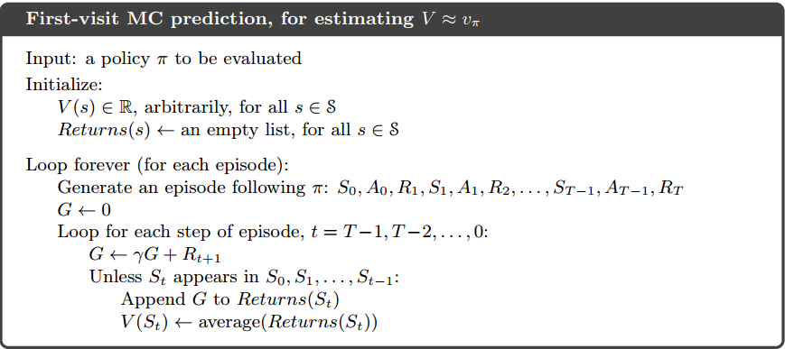
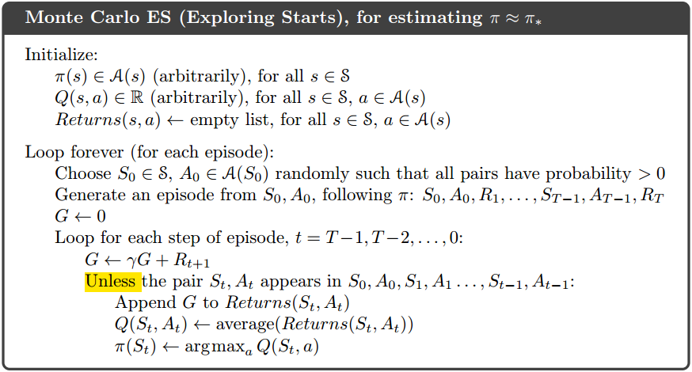
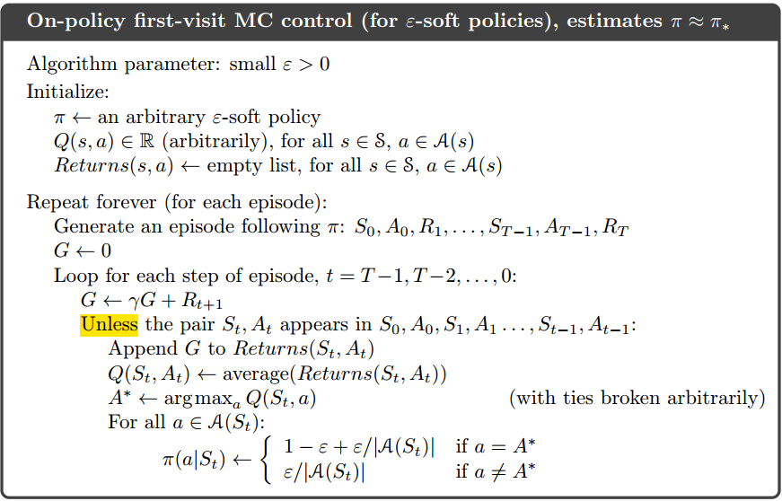
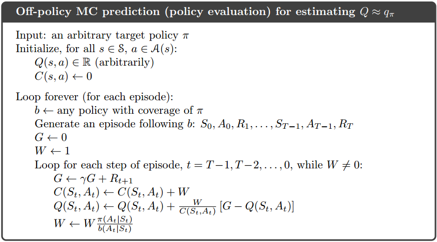
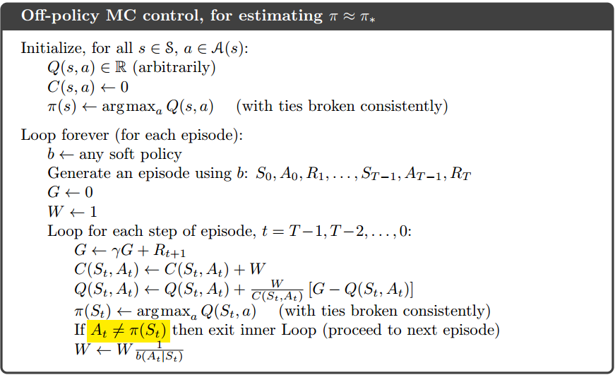

**Sample-based Learning Methods Week2 Notes**

<!-- more -->

# Monte Carlo Methods

Monte Carlo do NOT assume complete knowledge of the environment. It requires no prior knowledge of the environment's dynamics. It ONLY need **experience**--sample sequences of states, actions, and reward from actual or simulated interaction with an environment. Although a model is required, the model need only generate sample transitions, not the complete probability distributions of all possible transitions that is required for dynamic programming (DP).

Monte Carlo methods are ways of solving the reinforcement learning problem based on **averaging sample returns**. To ensure that well-defined returns are available, here we define Monte Carlo methods **only for episodic tasks**. Monte Carlo methods is incremental in an **episode-by-episode** sense, but not in a step-by-step (online) sense. Here we use it specifically for methods based on averaging complete returns.

Whereas there we computed value functions from knowledge of the MDP, here we **learn value functions from sample returns with the MDP**. The value functions and corresponding policies still interact to attain optimality in essentially the same way (GPI).

## Monte Carlo Prediction

An obvious way to estimate the expected return from experience is simply to **average the returns observed after visits to that state**. As more returns are observed, the average should converge to the expected value. This idea underlies all Monte Carlo methods.

By the law of large numbers the sequence of averages of these estimates converges to their expected value. Each average is itself an unbiased estimate, and the standard deviation of its error falls as $\frac{1}{\sqrt{n}}$, where n is the number of returns averaged.

### Compare between Monte Carlo and DP

| DP                                                           | Monte Carlo                                                  |
| ------------------------------------------------------------ | ------------------------------------------------------------ |
| Need to know the **environment transition probabilities**.   | **Just need experiences**. No need to keep a large model of the environment. |
| Backup diagram shows **all possible transitions**.           | On Backup diagram, Monte Carlo diagram shows **only those sampled on the one episode**. |
| The DP diagram includes **only one-step transitions**.       | The Monte Carlo diagram goes **all the way to the end of the episode** on the backup diagram. |
| DP method use successors calculated state to calculate current state value, which **do not handle each states independently**. Which is Bootstrap. | **The estimates for each state are independent**. In other words, Monte Carlo methods DO NOT bootstrap. |

For Monte Carlo, in particular, note that the computational expense of estimating the value of a single state is independent of the number of states. One can generate many sample episodes starting from the states of interest, averaging returns from only these states, ignoring all others.

## Monte Carlo Estimation of Action Values

If a model is not available, then it is particularly useful to estimate **action values** (the values of state–action pairs) rather than **state values**. Without a model, state values alone are not sufficient. One MUST explicitly estimate **the value of each action** for the values to be useful in suggesting a policy. Thus, one of our primary goals for Monte Carlo methods is to estimate $q\*$.

The ONLY complication is that many state–action pairs may NEVER be visited. We need to estimate the value of all the actions from each state, not just the one we currently favor. This is the general problem of **maintaining exploration**, as discussed in the context of the [k-armed bandit problem](/2020/03/03/Coursera-Reinforcement-Learning-Course1-Week1-Notes/).

- The first way to solve it is to try **infinite times with infinite number of episodes begin with nonzero probability on each state-action pair to start episodes** so that it is guaranteed that each state-action pair is visited and has a nonzero probability. We call this the <u>assumption</u> of **exploring starts**.
- The most common alternative approach is to consider only policies that are **stochastic** with a nonzero probability **of selecting all actions in each state**.

Obviously, in reality, we cannot gather infinite episodes from the interaction with the environment. It will be solved later.

## Monte Carlo Control

Here, we retain the assumption of exploring starts. The overall idea is to apply the [**generalized policy iteration (GPI)**](/2020/03/24/Coursera-Reinforcement-Learning-Course1-Week4-Notes/#Generalized-Policy-Iteration). We perform alternating complete steps of policy evaluation and policy improvement, **beginning** with an **arbitrary policy** $\pi\_0$ and ending with the optimal policy and optimal action-value function. We <u>assume</u> that we do indeed observe an infinite number of episodes and the episodes are generated with exploring starts.

Policy improvement is done by **making the policy greedy with respect to the current value function**. In this case we have an action-value function, and therefore **no model is needed to construct the greedy policy**. The policy will be deterministically chose with maximal action-value:

$$
\pi(s) \doteq \arg \max\_a q(s,a)
$$

The policy improvement can be proved by the [policy improvement theorem](/2020/03/24/Coursera-Reinforcement-Learning-Course1-Week4-Notes/#Policy-Control):

$$
\begin{align}
q\_{\pi\_k}(s, \pi\_{k+1}(s)) &= q\_{\pi\_k}(s, \arg \max\_a q\_{\pi\_k}(s,a)) \\\\
&= \max\_a q\_{\pi\_k}(s,a) \\\\
&\ge q\_{\pi\_k}(s, \pi\_k(s)) \\\\
&\ge v\_{\pi\_k}(s)
\end{align}
$$

In this way Monte Carlo methods can be used to **find optimal policies given only sample episodes and no other knowledge of the environment’s dynamics**.

### Monte Carlo with Exploring Starts

The algorithm pseudo-code is below, it gives the solution of infinite number of episodes showed in the next chapter:

# Solutions of Two Assumptions

## Infinite number of episodes solution

- One is to **hold firm to the idea** of approximating $q\_{\pi\_k}$ in each policy evaluation. However, it is also likely to require
  far too many episodes to be useful in practice on any but the smallest problems.
- Another one is **similar to the idea of GPI**. On each evaluation step we move the value function toward $q\_{\pi\_k}$, but we **do not expect to actually get close except over many steps**. One extreme form of the idea is to alternatively apply policy improvement and policy evaluation.

## Exploring Starts Solution

Exploring starts is a good method but cannot be applied to every task, such as self-driving cars. There are two alternative solutions:

- On-policy control methods attempt to **evaluate or improve the policy that is used to make decisions**.
- Off-policy control methods evaluate or **improve a policy different from that used to generate the data**. 

### On-policy Methods

In on-policy control methods the policy is generally **soft**, meaning that $\pi(a|s)>0$  for all $s \in S$ and all $a \in A(s)$, but **gradually shifted closer** and closer **to a deterministic optimal policy**. It means, in the on-policy method, we will move it **only to an $\epsilon-greedy$ policy** but not the optimal policy. The overall idea of on-policy Monte Carlo control is still that of GPI. For any $\epsilon-soft$ policy, $\pi$, any $\epsilon-greedy$ policy with respect to $q\_\pi$ is guaranteed to be better than or equal to $\pi$. The complete algorithm is given in the box below.

That any $\epsilon-greedy$ policy with respect to $q\_\pi$ is an improvement over any $\epsilon-soft$ policy $\pi$ is assured by the policy improvement theorem. The proof can be found in page 101-102 in [the book](http://www.incompleteideas.net/book/RLbook2018.pdf). Although the $\epsilon-soft$ policy performs worse than the optimal policy in general, it always performs reasonably well and allow us to get rid of exploring starts.

### Off-policy Methods (Off-policy Monte Carlo Prediction via Importance Sampling)

Off-policy control methods has two policies on the same episode. One that is **learned about and that becomes the optimal policy**, called **target policy**, and one that is **more exploratory and is used to generate behavior**, called the **behavior policy**. In this case we say that **learning is from data “off” the target policy**, and the overall process is termed off-policy learning.

Here, we only consider the [prediction problem](/2020/03/24/Coursera-Reinforcement-Learning-Course1-Week4-Notes/#Policy-Evaluation-and-Control), in which both target and behavior policies are fixed. We require that $\pi(a|s)>0$ implies $b(a|s)>0$, which is called the **assumption of coverage**, to assure that every action taken under $\pi$ is also taken under $b$. It follows from coverage that **$b$ must be stochastic in states** where it is not identical to $\pi$. The target policy **$\pi$ may be deterministic**.

#### Importance sampling

Almost all off-policy methods utilize **importance sampling**, a general technique for estimating expected values under one distribution given samples from another. We apply importance sampling to off-policy learning by weighting returns according to the relative probability of their trajectories occurring under the target and behavior policies, called the **importance-sampling ratio**. Given a starting state $S\_t$, the probability of the subsequent state-action trajectory, $A\_t$, $S\_{t+1}$, $A\_{t+1}$, $\cdots$, $S\_T$, occurring under any policy $\pi$ is:
$$
Pr\{A\_t, S\_{t+1}, A\_{t+1}, \cdots, S\_T|S\_t, A\_{t:T-1} \sim \pi\}=\prod\_{k=t}^{T-1}\pi(A\_k|S\_k)p(S\_{k+1}|S\_k, A\_k)
$$
where $p$ is the [state-transition probability function](/2020/03/03/Coursera-Reinforcement-Learning-Course1-Week2-Notes/#Common-Used-Formulas). Thus, the relative probability of the trajectory under the target and behavior policies is:
$$
\rho\_{t:T-1} \doteq \frac{\prod\_{k=t}^{T-1}\pi(A\_k|S\_k)p(S\_{k+1}|S\_k, A\_k)}{\prod\_{k=t}^{T-1}b(A\_k|S\_k)p(S\_{k+1}|S\_k, A\_k)}=\prod\_{k=t}^{T-1}\frac{\pi(A\_k|S\_k)}{b(A\_k|S\_k)}
$$
Since both policies depend on the same episodes, although we don't know the exactly state transition probabilities, they are obviously identical. The importance sampling ratio ends up **depending only on the two policies and the sequence**, not on the MDP.

Now. we have the returns $G\_t$ from the behavior policy $b$ and its expectation:
$$
\mathbb{E}[G\_t|S\_t=s]=v\_b(s)
$$
With importance sampling coming in, we can convert it to the right expectation on policy $\pi$:
$$
\mathbb{E}[\rho\_{t:T-1}G\_t|S\_t=s]=v\_\pi(s)
$$
With a batch of observed episodes, It is convenient to number time steps in a way that increases across episode boundaries. That is, if the first episode of the batch ends in a terminal state at time 100, then the next episode begins at time $t = 101$. We define the following symbols for the following formulas:

- $\tau(s)$ denotes all steps that visit state s for an every-visit method, or the step of the first visit of state s for a first-visit method.
- $T(t)$ denotes the first termination step (time) after time t.
- $\{G\_t\}\_{t \in \tau(s)}$ denotes the return from $t$ to $T(t)$.
- $\{\rho\_{t:T (t)-1}\}\_{t \in \tau(s)}$ represents the corresponding importance-sampling ratio.

With the above symbols, there are two representations of the value function

- Ordinary importance sampling

$$
V(s) \doteq \frac{\sum\_{t \in \tau(s)}\rho\_{t:T(t)-1}G\_t}{|\tau(s)|}
$$

- Weighted importance sampling

$$
V(s) \doteq \frac{\sum\_{t \in \tau(s)}\rho\_{t:T(t)-1}G\_t}{\sum\_{t \in \tau(s)}\rho\_{t:T(t)-1}}
$$

Formally, the **difference** between the **first-visit methods** of the two kinds of importance sampling is expressed in their **biases and variances**.

|                              | bias         | variance                                                     |
| ---------------------------- | ------------ | ------------------------------------------------------------ |
| Ordinary Importance Sampling | **unbiased** | **unbounded** because the variance of the ratios can be unbounded |
| Weighted Importance Sampling | **biased**   | **bounded** since the largest weight on any single return is one |

For the weighted importance sampling, the bias converges asymptotically to zero as the number of samples increases.

The **every-visit methods** for ordinary and weighed importance sampling are **both biased** though the bias falls asymptotically to zero as the number of samples increases. In practice, every-visit methods are often preferred because they remove the need to keep track of which states have been visited and because they are much easier to extend to approximations.

\* *<u>The complete off-policy method on prediction problem is showed in the next section.</u>*

### Incremental Implementation

For the **on-policy** method, just like it mentioned [here](/2020/03/03/Coursera-Reinforcement-Learning-Course1-Week1-Notes/#Incremental-Implementation), we **average returns rather than rewards**.

For the **off-policy** method, in **ordinary importance sampling**, the returns are scaled by the importance sampling ratio $\rho\_{t:T(t)-1}$ and all other parts are the same as on-policy method.

For the **off-policy** method, in **weighted importance sampling**, the algorithm is slightly different with the original one. Since we are talking about the value estimation of a one state, we use new symbols to simplify the formula. Here, we use $G\_i$ denotes the $G\_t$ value of the $i$-th visited state $s$, $W\_i$ denotes $\rho\_{t\_i:T(t\_i)-1}$, and $C\_i$ denotes the cumulate sum of $W\_i$ from $i=1$. Then,

$$
\begin{align}
V\_n &\doteq \frac{\sum\_{k=1}^{n-1}W\_kG\_k}{\sum\_{k=1}^{n-1}W\_k}, &n \ge 2 \\\\
V\_{n+1} &\doteq V\_n + \frac{W\_n}{C\_n}[G\_n-V\_n], &n \ge 1
\end{align}
$$

where $C\_0 \doteq 0$ and $V\_1$ is arbitrary.

The complete algorithm is below:

The algorithm is nominally for the off-policy case, using weighted importance sampling, but applies as well to the on-policy case just by choosing the target and behavior policies as the same (in which case ($\pi = b$), $W$ is always 1). 

### Off-policy Monte Carlo Control

The algorithm is based on GPI and weighted importance sampling, for estimating $\pi\_\*$ and $q\_\*$.

A potential problem is that this method learns ONLY from the tails of episodes, when all of the remaining actions in the episode are greedy. **If non-greedy actions are common, then learning will be slow**, particularly for states appearing in the early portions of long episodes. If it is serious, the most important way to address it is probably by incorporating temporal-difference learning.

### Compare between two control methods

All learning control methods face a dilemma: They seek to learn action values conditional on subsequent optimal behavior, but they need to behave non-optimally in order to explore all actions (to find the optimal actions).

- The on-policy approach is actually a **compromise**, it learns action values not for the optimal policy but **for a near-optimal policy that still explores**.
- The off-policy is more **straightforward** to it. It separate the policy to two policies and each one only does their job.

For other parts:

On-policy:

- On-policy methods are generally simpler and are considered first.

Off-policy

- Off-policy methods are more powerful and general. They include on-policy methods as the special case in which the target and behavior policies are the same.

- Off-policy methods require additional concepts and notation, and because the data is due to a different policy, off-policy methods are often of greater variance and are slower to converge.

- Off-policy methods also have a variety of additional uses in applications. For example, they can often be applied to learn from data generated by a conventional non-learning controller, or from a human expert. Off-policy learning is also seen by some as key to learning multi-step predictive models of the world’s dynamics .
